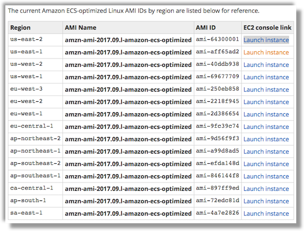

# Creating a custom AMI for genomics

Genomics, the main use case for Cromwell, is a data-heavy workload and requires some modification to the standard AWS Batch processing environment. In particular, we need to scale underlying instance storage that Tasks/Jobs run on top of to meet unpredictable runtime demands.

A default AWS Batch environment assumes that the storage available to the [Amazon ECS-Optimized AMI](https://docs.aws.amazon.com/AmazonECS/latest/developerguide/ecs-optimized_AMI.html) meets the needs of most customers. Any other needs, such as the large scratch storage requirements noted above or devices like GPUs, can be handled by providing AWS Batch with a custom [Compute Resource AMI](https://docs.aws.amazon.com/batch/latest/userguide/compute_resource_AMIs.html).

We have provided a script below ([Step 2](#step-2)) that launches and customizes the ECS-Optimized AMI. It will:

1. Launch and instance with a encrypted EBS volumes for the Docker container OS volumes and scratch space
2. Adjust the system settings to mount the scratch on instance start.
3. Install and configure a small service to monitor and automatically expand the Docker volumes scratch space by expanding the underlying EBS volume
4. Make the necessary adjustments to the Amazon Elastic Container Service (ECS) agent to work with AWS Batch
5. Adjust the network settings to allow for containers to query intance metadata for their Task IAM roles.
6. (Optional) Provide the Docker daemon credentials to access private registries such as Docker Hub.


## [Step 1.](id:step-1) Getting the AMI ID of an ECS-Optimized AMI for your region

You will need the AMI ID of the latest ECS-Optimized AMI. You can get a list of the current AMI IDs by region on the [documentation page](https://docs.aws.amazon.com/AmazonECS/latest/developerguide/ecs-optimized_AMI.html) documentation page.


[](https://docs.aws.amazon.com/AmazonECS/latest/developerguide/ecs-optimized_AMI.html)

Copy the appropriate AMI ID for the next step (e.g. `ami-aff65ad2`).

## [Step 2.](id:step-2) Create a AWS Batch Custom Compute Resource AMIs

Download and execute the script that creates the custom AMI.

```bash
aws s3 cp s3://cromwell-aws-batch/files/create-custom-ami.sh .
sh create-custom-ami.sh
```

Make a note of the instance ID and AMI ID that were returned.

## [Step 5.](id:step-5) Create a new Amazon Machine Image for Batch

Exit the SSH session and create a new AMI from your development machine using the AWS CLI.

```bash
# From your development machine
aws ec2 create-image --instance-id ${INSTANCE_ID} \
                     --name "cromwell-aws-$(date '+%Y%m%d-%H%M%S')" \
                     --description "A custom AMI for use with Cromwell on AWS Batch"
                     --no-reboot
# Output:
# {
#     "ImageId": "ami-123abc456"
# }
```

Make a note of the AMI ID that was returned, we will need it for future sections.


## [Step 3.](id:step-3) Clean up

You can now terminate the instance that was used to create the custom AMIs

```bash
aws ec2 terminate-instances --instance-ids ${INSTANCE_ID}
```
