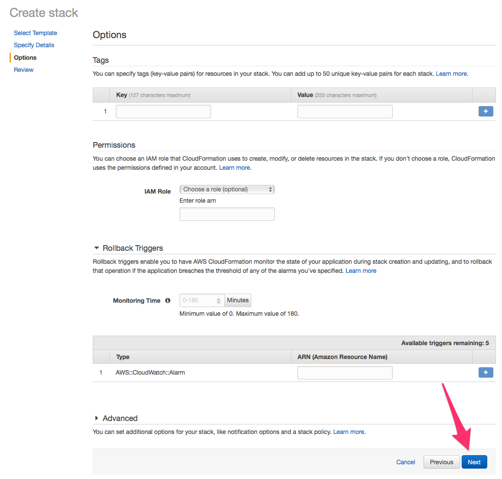
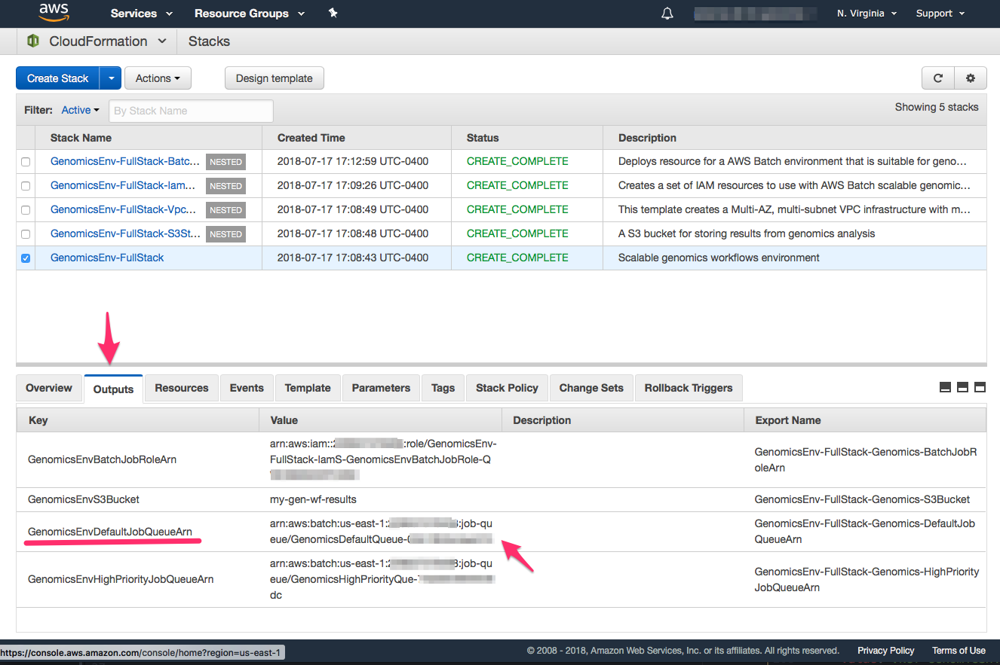

## Launching the CloudFormation stacks

The links below provide CloudFormation templates to deploy a base AWS Batch environment for genomics workflows. The `Full Stack` template is self-contained and will create all of the AWS resources, including VPC network, security groups, etc. The template defaults to using two Availability Zones for deploying instances. If you need more than this, leverage the next template.

!!! important
    In all cases, you will need a AMI ID for the AWS Batch Compute Resource AMI that you created using the ["Create a Custom AMI"](./create-custom-ami) guide! We do not provide a default value since for most genomics workloads, you will need to account for more storage than the default AWS Batch AMI provides.

| Name | Description | Source | Launch Stack |
| -- | -- | :--: | -- |
| Full Stack   | Launch a full AWS environment, including a new VPC across 2 Availability Zones, IAM policies and roles, Amazon S3 buckets for data and logging, and AWS Batch Job Queue and Compute Environments. _You must provide a custom AMI ID_.|  [:fa-eye:](https://aws-genomics-workflows.s3.amazonaws.com/templates/aws-genomics-root.template.yaml) |  |

This second template will deploy the same environment within a existing VPC. You can leverage this template if you want to span Jobs across more (or less) than two Availability Zones. You can read more about VPCs in the ["Notes on Amazon VPC"](./notes-vpc.md ) section.

| Name | Description | Source | Launch Stack |
| -- | -- | :--: | -- |
| Existing VPC | Create AWS Batch Job Queues and Compute Environments, a secure Amazon S3 bucket, and IAM policies and roles within an **existing** VPC. This is also a good choice if you want to expand beyond 2 AZs. _NOTE: You must provide custom AMI ID, VPC ID, and subnet IDs_. |  [:fa-eye:](https://aws-genomics-workflows.s3.amazonaws.com/templates/aws-genomics-root-novpc.template.yaml) |  |

The CloudFormation templates are actually a [nested stack](https://docs.aws.amazon.com/AWSCloudFormation/latest/UserGuide/using-cfn-nested-stacks.html), a hierarchy of templates that pass values from a parent template to dependent templates. Below are the stand-alone CloudFormation templates for S3, IAM, and AWS Batch. These are handy in case you need to modify the individual components, or need to have another individual with elevated privileges to execute one of them (e.g. the IAM template). They are in order of dependency, and you will need to provide output values from one template to the dependent templates.

| Name | Description | Source | Launch Stack |
| -- | -- | :--: | -- |
| Amazon S3 | Creates a secure Amazon S3 bucket to read from and write results to. |   [:fa-eye:](https://aws-genomics-workflows.s3.amazonaws.com/templates/aws-genomics-s3.template.yaml) |  |
| Amazon IAM   | Create the necessary IAM Roles. This is useful to hand to someone with the right permissions to create these on your behalf. _You will need to provide a S3 bucket name_. |  [:fa-eye:](https://aws-genomics-workflows.s3.amazonaws.com/templates/aws-genomics-iam.template.yaml) |  |
| AWS Batch | Creates AWS Batch Job Queues and Compute Environments. You will need to provide the details on IAM roles and instance profiles, and the IDs for a VPC and subnets. |  [:fa-eye:](https://aws-genomics-workflows.s3.amazonaws.com/templates/aws-genomics-batch.template.yaml) |  |

## **`Full Stack`** guided walk-through

Here we provide a walkthrough launching the `Full Stack` CloudFormation template.

### Step 1. Launch the template

Click on the `Launch Stack` button, and you will be taken to the CloudFormation web console. Click on the `Next` button

### Step 2. Specify the template parameters

You will need to provide values for the name of the S3 bucket, EC2 key pair, the custom AMI ID (created from the [previous step](./create-custom-ami.md)) and two Availability Zones. You can also choose to alter default values.

Advance to the next screen by clicking on the `Next` button, and again on the following screen.

On the next screen scroll to the bottom of the form to the `Capabilities` section. Click on the IAM capabilities checkbox and move on the the `Next` page.

### Step 4. Take a break

The nested stacks will take about 15 minutes to finish. You may want to get some more  :coffee: or :tea: at this point.

### Step 5. Copy the AWS Batch Job Queue ARN

Now that the full CloudFormation nested stack set is launched, click on the `Outputs` tab and copy down the AWS Batch Job Queue ARN for the default and high-priority queues. You will need these when configuring a workflow system, such as AWS Step Functions, Cromwell, or Nextflow, to use AWS Batch as a backend for task distribution.

