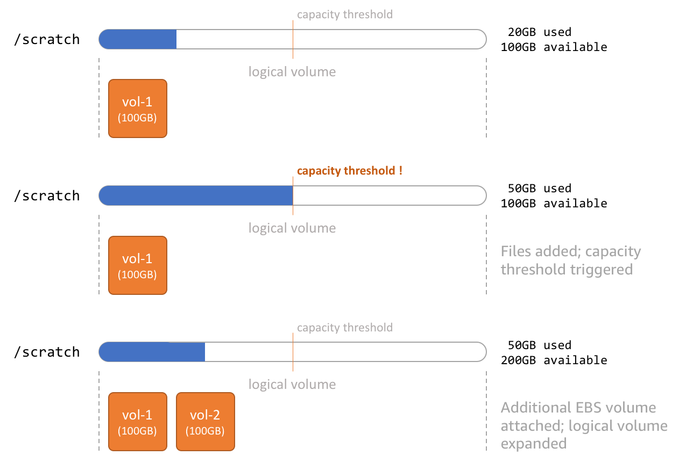

# Creating Custom Compute Resources

Genomics is a data-heavy workload and requires some modification to the defaults
used for batch job processing. In particular, we need to be able to scale the
storage used by the instances Tasks/Jobs run on to meet unpredictable runtime 
demands.

By default, AWS Batch relies upon the [Amazon ECS-Optimized AMI](https://docs.aws.amazon.com/AmazonECS/latest/developerguide/ecs-optimized_AMI.html)
as the image used to for instances it launches to run jobs.  What this image 
provides is sufficient in most cases.  Specialized needs, such as the large 
storage requirements noted above, require customization of the base AMI.

This section provides two methods for customizing the base ECS-Optimized AMI 
that adds an expandable working directory that the Jobs will use to write data.
That directory will be monitored by a process that inspects the free space 
available and adds more EBS volumes and expands the filesystem on the fly, like so:



## EC2 Launch Template

The simplest method for customizing an instance is to use an EC2 Launch Template.
This works best if your customizations are relatively light - such as installing
a few small utilities or making specific configuration changes.

This is because Launch Templates run `UserData` when an instance first launches.
The longer these scripts / customizations take to complete, the longer it will
be before your instance is ready for work.

Since this will be working with AWS Batch, you only need to supply the `UserData`
script below:

```text
MIME-Version: 1.0
Content-Type: multipart/mixed; boundary="==BOUNDARY=="

--==BOUNDARY==
Content-Type: text/cloud-config; charset="us-ascii"

packages:
- jq
- btrfs-progs
- python27-pip
- sed
- wget

runcmd:
- pip install -U awscli boto3
- cd /opt && wget https://aws-genomics-workflows.s3.amazonaws.com/artifacts/aws-ebs-autoscale.tgz && tar -xzf aws-ebs-autoscale.tgz
- sh /opt/ebs-autoscale/bin/init-ebs-autoscale.sh /scratch /dev/sdc  2>&1 > /var/log/init-ebs-autoscale.log

--==BOUNDARY==--
```

By default the `ebs-autoscale` monitor will add a 20GB EBS volume to the logical volume
mounted at `/scratch`.  If you want this volume to be larger initially, you can
specify a `/dev/sdc` volume in the Launch Template.

!!! note
    The mount point is specific to what orchestration method / engine you intend
    to use.  `/scratch` is considered the default for AWS Step Functions.  If you
    are using a 3rd party workflow orchestration engine this mount point will need
    to be adjusted to fit the engines expectations.

Once your Launch Template is created, you can reference it when you setup resources
in AWS Batch to ensure that jobs run therein have your customizations available
to them.

## Custom AMI

A more robust, but slightly more involved method for customizing an instance is
to create a new AMI based on the ECS Optimized AMI.  This is good if you have 
a lot of customization to do - lots of software to install and or preloading
large datasets that will be needed by jobs.

You can learn more about how to [create your own AMIs in the EC2 userguide](https://docs.aws.amazon.com/AWSEC2/latest/UserGuide/AMIs.html).

For a "single-click" solution for genomics workflows we have provided a 
CloudFormation template that performs the tasks neded via CloudFormation's UI.

| Name | Description | Source | Launch Stack |
| -- | -- | :--: | :--: |
{{ cfn_stack_row("Custom AMI (Existing VPC)", "GenomicsWorkflow-AMI", "aws-genomics-ami.template.yaml", "Creates a custom AMI that EC2 instances can be based on for processing genomics workflow tasks.  The creation process will happen in a VPC you specify") }}

The above CloudFormation template should take about 10-15min to complete. 
Once your AMI is created, you will need to jot down its unique AMI Id.  You will
need this when creating compute resources in AWS Batch.