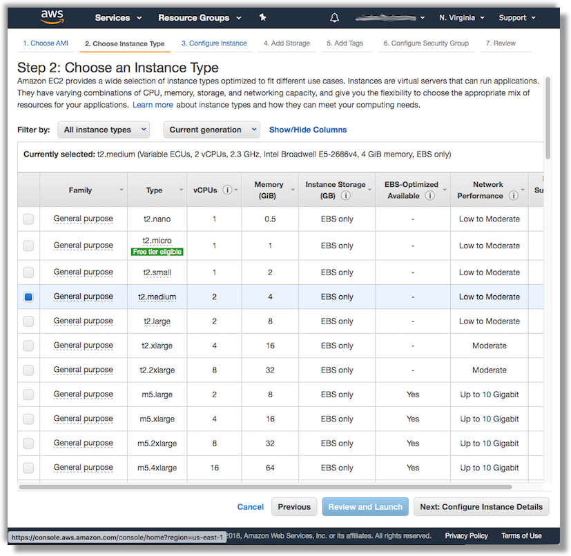
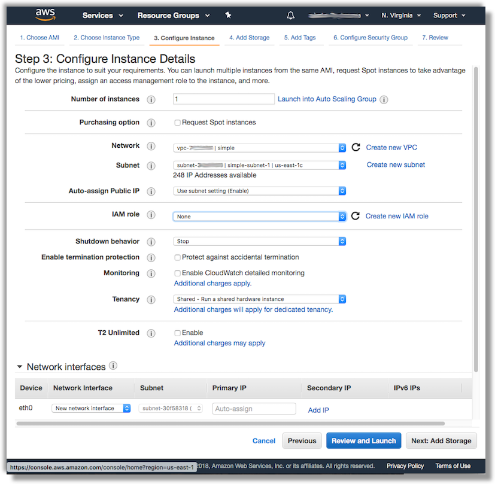
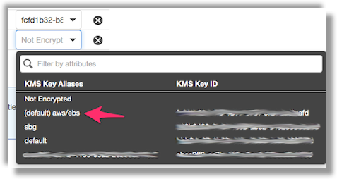
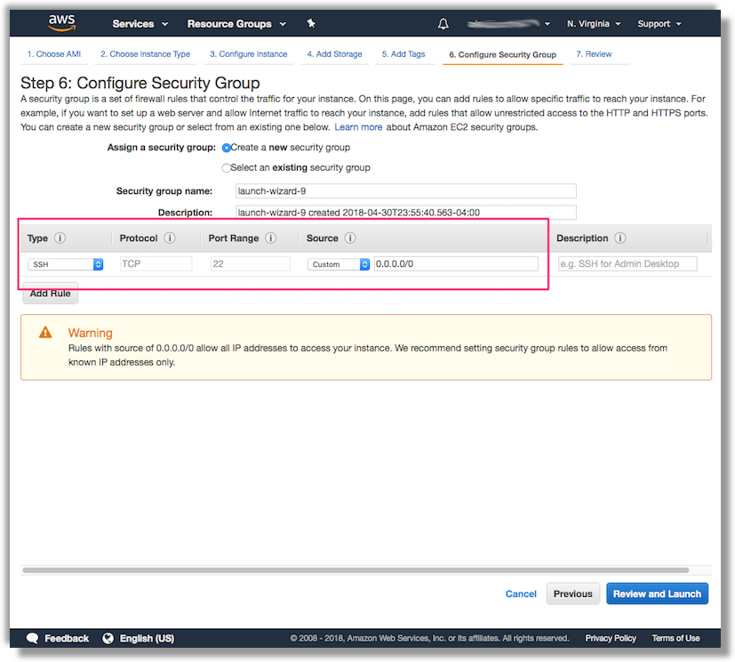
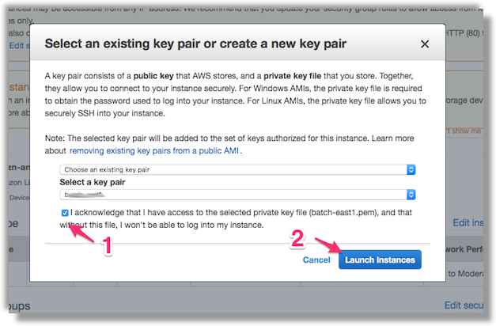
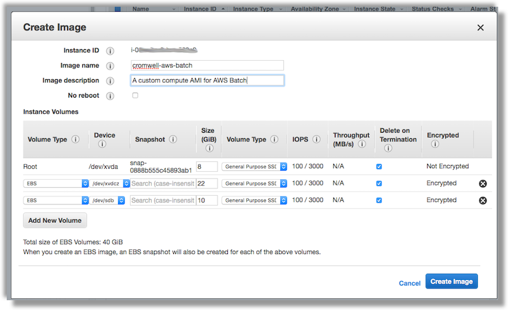

# Manually create a custom Compute Resource AMI for AWS Batch

A good starting base for a AWS Batch custom AMI for genomics is the [Amazon ECS-Optimized AMI](https://docs.aws.amazon.com/AmazonECS/latest/developerguide/ecs-optimized_AMI.html). Specifically the Amazon ECS-optimized AMI is preconfigured and tested on Amazon ECS by AWS engineers. It is the simplest AMI for you to get started and to get your containers running on AWS quickly.

The current Amazon ECS-optimized AMI (amzn-ami-2017.09.l-amazon-ecs-optimized) consists of:

* The latest minimal version of the Amazon Linux AMI
* The latest version of the Amazon ECS container agent (1.17.3)
* The recommended version of Docker for the latest Amazon ECS container agent (17.12.1-ce)
* The latest version of the ecs-init package to run and monitor the Amazon ECS agent (1.17.3-1)

## [Step 1.](id:step-1) Getting the AMI ID of an ECS-Optimized AMI for your region

You will need the AMI ID of the latest ECS-Optimized AMI. You can get a list of the current AMI IDs by region on the [documentation page](https://docs.aws.amazon.com/AmazonECS/latest/developerguide/ecs-optimized_AMI.html) documentation page.

Click on the `Launch instance` link for appropriate AMI for your region.

## [Step 2.](id:step-2) Launch and configure a new instance

We recommend that you select the `t2.micro` or `t2.medium` instance size when launching

You'll want to confirm that the instance is auto-assigned a public IP so that you can connect to it via SSH.

TODO: Add userdata section.

Next add a new 20GB EBS volume for scratch space. Make sure that you check off the box for deleting the volumes on termination, and also assign a encryption key (the default EBS one is fine).

TODO: alter to use 20GB volume

Click through the next two screens for adding tags. On Step 6. "Configuring Security Group" confirm that the instance will allow inbound SSH traffic to port 22.

Next, click on "Review and Launch" --> "Launch" to get to the dialog confirming that you have a EC2 Key Pair. We created one in the [Prerequisites] guide, you can use that one, but otherwise create a new key pair.

The launch process will now start. The block of instructions pasted into the [User Data](https://docs.aws.amazon.com/AWSEC2/latest/UserGuide/user-data.html) section will execute a set of commands that format the scratch space and configure the storage monitoring process. Once the health checks pass, you can move on to the next step and create a new AMI for use in genomics batch processing.

## [Step 4.](id:step-4) OPTIONAL: Configure ECS for private Docker registry use

If you want to leverage Docker containers in **private** registries, you will need to SSH into the instance and configure it with your private repository credententials. The steps to do this are covered in the
[ECS documentation on private registry authentication](https://docs.aws.amazon.com/AmazonECS/latest/developerguide/private-auth.html).

## [Step 5.](id:step-5) Create a new Amazon Machine Image

Finally, go back to the EC2 console and create the AMIs using the web console.

TODO: Update screenshots of AMI Image creation

Make a note of the AMI ID using the console

## [Step 6.](id:step-6) Clean up

Once the AMI image is "available", you can terminate the instance that was used to create the custom AMIs.

