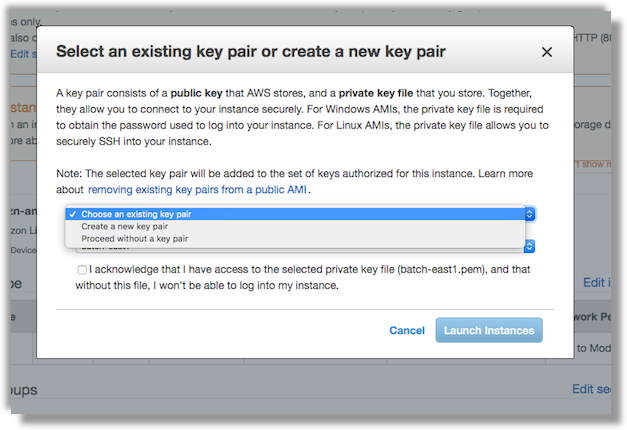

# Creating a Custom AMI using the AWS Console

If you want to instead configure a custom AMI using a manual process and the AWS Web Console GUI. follow the steps below.


## [Step 1.](id:step-1) Configure the instance launch

Go to the AWS Web console for EC2 and click on the "Launch Instances" button

We recommend that you select the `t2.micro` or `t2.medium` instance size when launching


You'll want to confirm that the instance is auto-assigned a public IP so that you can connect to it via SSH.


Next add a new 10GB EBS volume for scratch space. Make sure that you check off the box for deleting the volumes on termination, and also assign a encryption key (the default EBS one is fine).


Click through the next two screens for adding tags. On Step 6. "Configuring Security Group" confirm that the instance will allow inbound SSH traffic to port 22.


Next, click on "Review and Launch" --> "Launch" to get to the dialog confirming that you have a EC2 Key Pair. We created one in the [Prerequisites] guide, you can use that one, but otherwise create a new key pair.




Once the instance is running, connect to it via SSH


```bash
[user@machine ~]$ ssh -i MyKeyPair.pem ec2-user@123.12.12.123
The authenticity of host '123.12.12.123 (123.12.12.123)' cannot be established.
ECDSA key fingerprint is SHA256:yMyvY8wLCiL+aB0Bbu5SAB2pT2R8vMCi+xKqjlxbkJ/Bw.
Are you sure you want to continue connecting (yes/no)? yes
Warning: Permanently added '123.12.12.123' (ECDSA) to the list of known hosts.
Last login: Tue May  1 04:16:35 2018 from 72.21.1.64

   __|  __|  __|
   _|  (   \__ \   Amazon ECS-Optimized Amazon Linux AMI 2017.09.l
 ____|\___|____/

For documentation, visit http://aws.amazon.com/documentation/ecs
4 package(s) needed for security, out of 7 available
Run "sudo yum update" to apply all updates.
Amazon Linux version 2018.03 is available.
[ec2-user@ip-10-0-0-135 ~]$
```

## [Step 2.](id:step-2) Creating the scratch volume

Here we will create a logical volume group to serve as scratch space for Docker containers. Below are simply the commands that are needed, for a full explaination of what is happening, refer to the ["Notes on Docker EBS autoscaling"]() guide.

Copy and paste the commands below, they will leverage the LVM2 capabilities to create the scratch volume for the Docker containers.

```bash
# run these as the root user (e.g. 'sudo su -' )
cd /tmp
curl -O https://cromwell-aws-batch.s3.amazonaws.com/files/docker-ebs-autoscale.tar.gz

# create the new logical volume, format, and mount
sh src/creat-logical-volume.sh /dev/xvdb docker_scratch docker_scratch_pool /docker_scratch

# install the
cp src/etc/init/docker-ebs-autoscale.conf /etc/init/docker-ebs-autoscale.conf
cp src/usr/local/bin/docker-ebs-autoscale.sh /usr/local/bin/docker-ebs-autoscale.sh
cp src/etc/logrotate.d/docker-ebs-autoscale /etc/logrotate.d/docker-ebs-autoscale
initctl reload-configuration
initctl start docker-ebs-autoscale

# remove the temp files (optional)
rm -fr src docker-ebs-autoscale.tar.gz
```

You can see that the `/docker_scratch` volume is mounted, formatted and is empty

```bash
[root@ip-10-0-0-135 bin]# ls -l /docker_scratch/
total 16
drwx------ 2 root root 16384 May  1 05:14 lost+found

[root@ip-10-0-0-135 bin]# df -h /docker_scratch/
Filesystem                                      Size  Used Avail Use% Mounted on
/dev/mapper/docker_scratch-docker_scratch_pool  9.8G   23M  9.2G   1% /docker_scratch
```

## [Step 3.](id:step-3) Configuring ECS for use snapshotting the AMI

First, stop the ECS service and remove the ECS runtime configuration file

```bash
# run these as the root user (e.g. 'sudo su -' )
stop ecs

rm -rf /var/lib/ecs/data/ecs_agent_data.json
```

Next, we will adjust the instance network to allow containers to query for AWS credentials via the [instance metadata](https://docs.aws.amazon.com/AWSEC2/latest/UserGuide/ec2-instance-metadata.html).

```shell
sudo sysctl -w net.ipv4.conf.all.route_localnet=1
sudo iptables -t nat -A PREROUTING -p tcp -d 169.254.170.2 --dport 80 -j DNAT --to-destination 127.0.0.1:51679
sudo iptables -t nat -A OUTPUT -d 169.254.170.2 -p tcp -m tcp --dport 80 -j REDIRECT --to-ports 51679
sudo service iptables save
```

You can get more information about what just happened from the ECS documentation on [IAM roles for Tasks](https://docs.aws.amazon.com/AmazonECS/latest/developerguide/task-iam-roles.html)


## [Step 4.](id:4) (Optional) Configuring AWS for access to private Docker Hub repositories

Since AWS Batch relies on ECS, we leverage the ECS container agent's ability to [authenticate against private registries](https://docs.aws.amazon.com/AmazonECS/latest/developerguide/private-auth.html#enabling-private-registry)

Specifially, you need a JSON block of your registry's URL, username, email, and password. Here is an example for Docker Hub:

```javascript
{
  "https://index.docker.io/v1/": {
    "username": "my_name",
    "password": "my_password",
    "email": "email@example.com"
  }
}
```

Open the /etc/ecs/ecs.config file and add the ECS_ENGINE_AUTH_TYPE and ECS_ENGINE_AUTH_DATA values for your registry and account.

```bash
sudo vi /etc/ecs/ecs.config
```

Then we need to add in the `ECS_ENGINE_AUTH_TYPE` and `ECS_ENGINE_AUTH_DATA` like so:

```
ECS_ENGINE_AUTH_TYPE=docker
ECS_ENGINE_AUTH_DATA={"https://index.docker.io/v1/":{"username":"my_name","password":"my_password","email":"email@example.com"}}
```

### [Step 5.](id:step-5) Snapshotting the AMI

Finally, go back to the EC2 console and create the AMIs


Make a note of the AMI ID using the console


