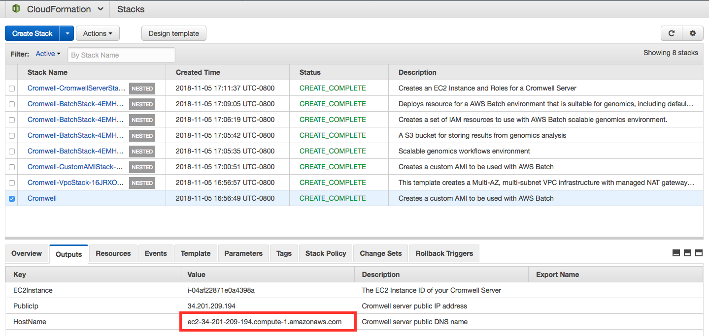

# Cromwell on AWS Batch


[Cromwell](https://cromwell.readthedocs.io/en/stable/) is a workflow management
system for scientific workflows developed by the [Broad Institute](https://broadinstitute.org/)
and supports job execution using [AWS Batch](https://aws.amazon.com/batch/).

## TL;DR

If you need a Cromwell server backed by AWS **now** and will worry about the
details later, use the CloudFormation template below.

| Name | Description | Source | Launch Stack |
| -- | -- | :--: | :--: |
{{ cfn_stack_row("Cromwell All-in-One", "Cromwell", "cromwell/cromwell-aio.template.yaml", "Create all resources needed to run Cromwell on AWS: a Custom AMI, S3 Bucket, AWS Batch Environment, and Cromwell Server Instance") }}

When the above stack is complete, navigate to the `HostName` that is generated
in the outputs to access Cromwell via its SwaggerUI.




## Prerequisites

To get started using Cromwell on AWS you'll need the following setup in your AWS
account:

* Custom Genomics AMI with Cromwell Additions
* EC2 Instance as a Cromwell Server
* S3 Bucket for inputs and outputs
* IAM Roles for Batch job execution
* AWS Batch
    * Compute Environments
    * Job Queues

The documentation and CloudFormation templates on this site will help you get
these setup.

## Custom AMI with Cromwell Additions

Follow the [instructions on creating a custom AMI](/aws-batch/create-custom-ami/)
with the following changes:

* specify the scratch mount point as `/cromwell_root`
* make sure that cromwell additions are included in the ami
    * select "cromwell" as the AMI type if using the CloudFormation template
    * use `cromwell-genomics-ami.cloud-init.yaml` as `user-data` with the python script

Once complete, you will have a new AMI ID to give to AWS Batch to setup compute environments.

## Batch Infrastructure for Genomics

To create the remaining pieces of infrastructure:

* S3 Bucket
* IAM Roles
* Batch Compute Environments
* Batch Queues

use the [CloudFormation templates](/aws-batch/configure-aws-batch-cfn) provided in the previous sections.

## Cromwell Server

To ensure the highest level of security, and robustness for long running workflows,
it is recommended that you use an EC2 instance as your Cromwell server for submitting
workflows to AWS Batch.

A couple things to note:

* This server does not need to be permanent. In fact,
  when you are not running workflows, you should stop or terminate the instance
  so that you are not paying for resources you are not using.

* You can launch a Cromwell server just for yourself and exactly when you need it.

* This server does not need to be in the same VPC as the one that Batch will
  launch instances in.

The following CloudFormation template will create a CromwellServer instance with
Cromwell installed, running, and preconfigured to operate with an S3 Bucket and Batch
Queue that you define at launch.

| Name | Description | Source | Launch Stack |
| -- | -- | :--: | :--: |
{{ cfn_stack_row("Cromwell Server", "CromwellServer", "cromwell/cromwell-server.template.yaml", "Create an EC2 instance and an IAM instance profile to run Cromwell") }}

Once the stack is created, you can access the server in a web browser via the 
instance's hostname.  There you should see Cromwell's SwaggerUI, which provides
a simple web interface for submitting workflows.

The CloudFormation template above also configures the server with integration to
[Amazon CloudWatch](https://aws.amazon.com/cloudwatch/) for monitoring Cromwell's 
log output and [AWS Systems Manager](https://aws.amazon.com/systems-manager/) for
performing any maintenance, or gaining terminal access.

For details of how this instance was constructed - e.g. if you want to customize
it for your purposes, checkout the template source and read the sections below.

### Cromwell server requirements

This instance needs the following:

* Java 8 (per Cromwell's requirements)
* The latest version of Cromwell with AWS Batch backend support (v35+)
* Permissions to
    * read from the S3 bucket used for input and output data
    * submit / describe / cancel / terminate jobs to AWS Batch queues

The permissions above can be added to the instance via policies in an [instance profile](https://docs.aws.amazon.com/IAM/latest/UserGuide/id_roles_use_switch-role-ec2_instance-profiles.html).
Example policies are shown below:

### Access to AWS Batch
Lets the Cromwell server instance submit and get info about AWS Batch jobs.

```json
{
    "Version": "2012-10-17",
    "Statement": [
        {
            "Sid": "CromwellServer-BatchPolicy",
            "Effect": "Allow",
            "Action": [
                "batch:DescribeJobQueues"
                "batch:DeregisterJobDefinition"
                "batch:TerminateJob"
                "batch:DescribeJobs"
                "batch:CancelJob"
                "batch:SubmitJob"
                "batch:RegisterJobDefinition"
                "batch:DescribeJobDefinitions"
                "batch:ListJobs"
                "batch:DescribeComputeEnvironments"
            ],
            "Resource": "*"
        }
    ]
}
```

### Access to S3
Lets the Cromwell server instance read and write data from/to S3 - i.e. the 
return codes (written to `rc.txt` files) for each job.

```json
{
    "Version": "2012-10-17",
    "Statement": [
        {
            "Sid": "CromwellServer-S3Policy",
            "Effect": "Allow",
            "Action": "s3:*",
            "Resource": [
                "arn:aws:s3:::<bucket-name>",
                "arn:aws:s3:::<bucket-name>/*",
            ]
        }
    ]
}
```


### Configuring Cromwell on AWS Batch

The following is an example `*.conf` file to use the `AWSBackend`.

```java
// cromwell.conf
include required(classpath("application"))

webservice {
    interface = localhost
    port = 8000
}

system {
    job-rate-control {
        jobs = 1
        per = 2 second
    }
}

aws {
  application-name = "cromwell"
  auths = [{
      name = "default"
      scheme = "default"
  }]
  region = "<your region>"
}

engine {
  filesystems {
    s3 { auth = "default" }
  }
}

backend {
  default = "AWSBATCH"
  providers {
    AWSBATCH {
      actor-factory = "cromwell.backend.impl.aws.AwsBatchBackendLifecycleActorFactory"
      config {
        root = "s3://<your-s3-bucket-name>/cromwell-execution"
        auth = "default"

        numSubmitAttempts = 3
        numCreateDefinitionAttempts = 3

        default-runtime-attributes {
          queueArn: "<your-queue-arn>"
        }

        filesystems {
          s3 {
            auth = "default"
          }
        }
      }
    }
  }
}
```

The above file uses the [default credential provider chain](https://docs.aws.amazon.com/sdk-for-java/v1/developer-guide/credentials.html) for authorization.

Replace the following with values appropriate for your accoutn and workload:

* `<your region>` : the AWS region your S3 bucket and AWS Batch environment are
  deployed into - e.g. `us-east-1`
* `<your-s3-bucket-name>` : the name of the S3 bucket you will use for inputs
  and outputs from tasks in the workflow.
* `<your-queue-arn>` : the Amazon Resoure Name of the AWS Batch queue you want
  to use for your tasks.

### Start the Cromwell server

!!! note
    The CloudFormation template above automatically starts Cromwell on launch.
    Use the instructions below are if you are provisioning your own EC2 instance.

Log into your server using SSH.  If you setup a port tunnel, you can interact
with Cromwell's REST API from your local machine:

```bash
$ ssh -L localhost:8000:localhost:8000 ec2-user@<cromwell server host or ip>
```

This port tunnel only needs to be open for submitting workflows.  You do not 
need to be connected to the server while a workflow is running.

Launch the server using the following command:

```bash
$ java -Dconfig.file=cromwell.conf -jar cromwell-35.jar server
```

!!! note
    If you plan on having this server run for a while, it is recommended you use
    a utility like `screen` or `tmux` so that you can log out while keeping
    Cromwell running.  Alternatively, you could start Cromwell as a detached
    process in the background using `nohup`.

You should now be able to access Cromwell's SwaggerUI from a web browser on
your local machine by navigating to:

[http://localhost:8000/](http://localhost:8000/)

## Running a workflow

To submit a workflow to your Cromwell server, you can use:

* Cromwell's SwaggerUI in a web-browser
* a REST client like [Insomnia](https://insomnia.rest/) or [Postman](https://www.getpostman.com/)
* or, the command line with `curl`

After submitting a workflow, you can monitor the progress of tasks via the
AWS Batch console.

The next section provides some examples of running Crommwell on AWS.