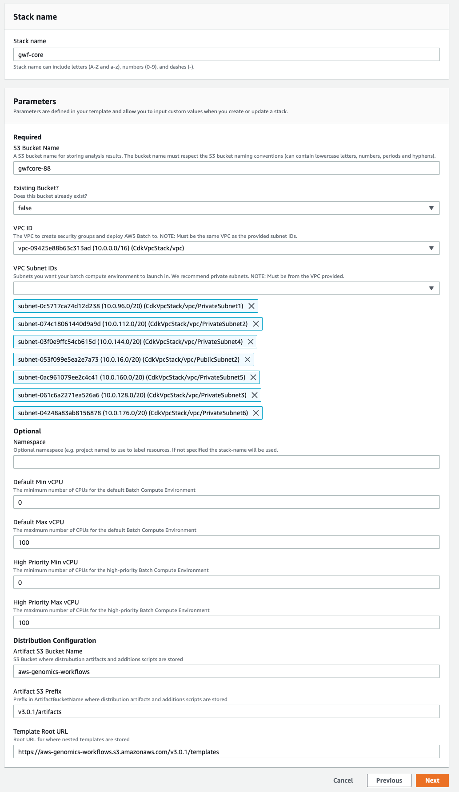
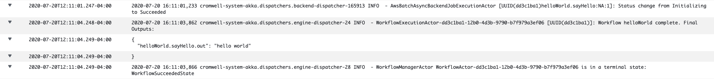
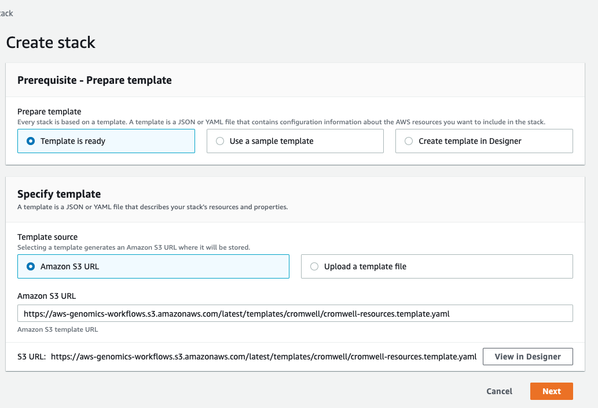

# Installing the Genomics Workflow Core and Cromwell

## Summary

The purpose of this document is to demonstrate how an AWS user can provision the infrastructure necessary to run Cromwell versions 52 and beyond on AWS Batch using S3 as an object store using CloudFormation. The instructions cover deployment into an existing VPC. There are two main steps: deploying the genomics workflow core infrastructure which can be used with Cromwell, Nextflow and AWS Step Functions, and the deployment of the Cromwell server and related artifacts.
* * *

## Assumptions

1. The instructions assume you have an existing AWS account with sufficient credentials to deploy the infrastructure or that you will use a role with CloudFormation that has sufficient privileges (admin role is recommended).
2. You have an existing VPC to deploy artifacts into. This VPC should have a minimum of two subnets with routes to the public internet. Private subnet routes may be through a NAT Gateway.

* * *

## Deployment of Genomics Workflow Core into an existing VPC.

Take note of the id of the VPC that you will use and the ids of the subnets of the VPC that you will use for the Batch worker nodes. We recommend using two or more private subnets. 

1. Open the CloudFormation consoles and select “**Create stack**” with new resources. Enter `https://aws-genomics-workflows.s3.amazonaws.com/latest/templates/gwfcore/gwfcore-root.template.yaml` as the Amazon S3 URL.


1. Select appropriate values for your environment including the VPC and subnets you recorded above. It is recommended to leave the Default and High Priority Min vCPU values at 0 so that the AWS Batch cluster will not have any instances running when there are no workflows running. Max vCPU values may be increased if you expect to run large workloads utilizing many CPUs. Leave the Distribution Configuration values with the preset defaults.



1. Optionally add tags and click **Next**

1. Review the parameters, acknowledge the Capabilities notifications and click “**Create Stack**”



The template will now create several nested stacks to deploy the required resources. This step will take approximately 10 minutes to complete. When this is complete you can proceed with the “[Deploy Cromwell Resources](#deploy-cromwell-resources)” section below.
* * *

## Deploy Cromwell Resources

1. Ensure all steps of the CloudFormation deployment of the Genomics Workflow Core have successfully completed before proceeding any further.
2. From the CloudFormation console select “**Create Stack**” and if prompted select “**With new resources (Standard)**”
3. Fill in the Amazon S3 URL with `https://aws-genomics-workflows.s3.amazonaws.com/latest/templates/cromwell/cromwell-resources.template.yaml`



4. Fill in appropriate values for the template. **For `GWFCoreNamespace` use the names space value you used in the section above****.** You should use the same VPC as you used in the previous step above. To secure your Cromwell server you should change the `SSH Address Range` and `HTTP Address Range` to trusted values, these will be used when creating the servers security group. 
5. You may either use the latest version of Cromwell (recommended) or specify a version **52 or greater.**
6. Select a MySQL compliant `Cromwell Database Password` that will be used for Cromwell’s metadata database. Select “**Next”**.


7. On the remaining two screens keep the defaults, acknowledge the IAM capabilities and then click “**Create Stack**”

Once the stack completes an EC2 will be deployed and it will be running an instance of the Cromwell server. You can now proceed with "[Testing your deployment](#testing-your-deployment)"
* * *

## Testing your Deployment

The following WDL file is a very simple workflow that can be used to test that all the components of the deployment are working together. Add the code block below to a file named `workflow.wdl`

```
workflow helloWorld {
    call sayHello
}

task sayHello {
    command {
        echo "hello world"
    }
    output {
        String out = read_string(stdout())
    }

    runtime {
       docker: "ubuntu:latest"
       memory: "1 GB"
       cpu: 1
    }
}
```

This task can be submitted to the servers REST endpoint using `curl` either from a client that has access to the servers elastic IP or from within the server itself using `localhost.` The hostname of the server is also emitted as an output from the cromwell-resources CloudFormation template.

```
curl -X POST "http://localhost:8000/api/workflows/v1" \
     -H "accept: application/json" \
     -F "workflowSource=@workflow.wdl"
```

It can take a few minutes for AWS Batch to realize there is a job in the work queue and provision a worker to run it. You can monitor this in the AWS Batch console. 

You can also monitor the Cromwell server logs in CloudWatch. There will be a log group called `cromwell-server.` Once the run is completed you will see output similar to:


If the run is successful subsequent runs will be “call cached” meaning that the results of the previous run will be copied for all successful steps. If you resubmit the job you will very quickly see the workflow success in the server logs and no additional jobs will be seen in the AWS Batch console. You can disable call caching for the job by adding an options file and submitting it with the run. This will cause the workflow to be re-executed in full.

```json5
{
    "write_to_cache": false,
    "read_from_cache": false
}
```

```shell
curl -X POST "http://localhost:8000/api/workflows/v1" \
     -H "accept: application/json" \
     -F "workflowSource=@workflow.wdl" \
     -F "workflowOptions=@options.json"
```

For a more realistic workflow, a WDL for simple variant calling using bwa-mem, samtools, and bcftools is available [here](https://github.com/wleepang/demo-genomics-workflow-wdl):

Clone the repo, and submit the WDL file to cromwell. The workflow uses default inputs from public data sources. If you want to override these inputs, modify the `inputs.json` file accordingly and submit it along with the workflow.
