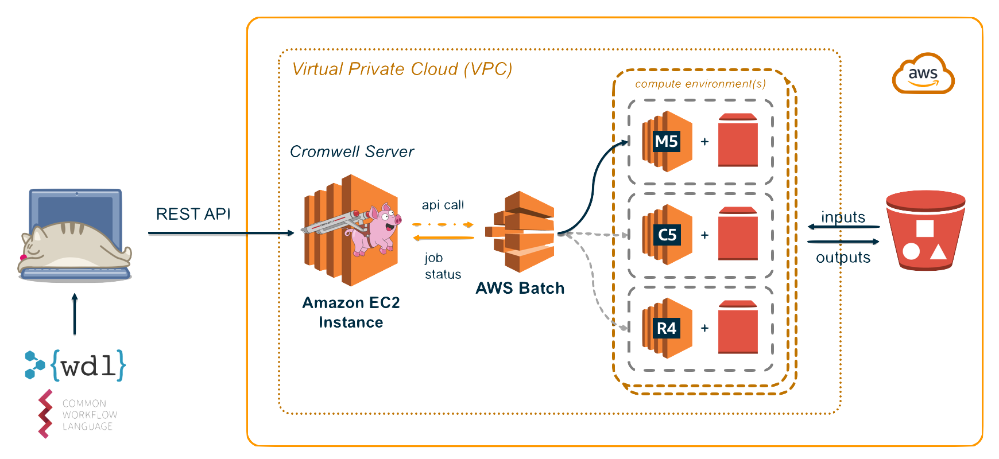

# Cromwell on AWS Batch



[Cromwell](https://cromwell.readthedocs.io/en/stable/) is a workflow management
system for scientific workflows developed by the [Broad Institute](https://broadinstitute.org/)
and supports job execution using [AWS Batch](https://aws.amazon.com/batch/).

## Requirements

To get started using Cromwell on AWS you'll need the following setup in your AWS
account:

* A VPC with at least 2 **private** subnets
* The Genomics Workflow [Core Environment](../../core-env/introduction.md)
* EC2 Instance as a Cromwell Server
* RDS Cluster for the Cromwell metadata database

The following will help you deploy these components.

### VPC

Cromwell uses a relational database for storing metadata information. In AWS you can use an RDS cluster for this. For security and availability is is recommended that your RDS cluster deploy into at least 2 private subnets. If the target VPC you want to deploy Cromwell into already has this, you can skip ahead. If not, you can use the CloudFormation template below, which uses the [AWS VPC Quickstart](https://aws.amazon.com/quickstart/architecture/vpc/), to create one meeting these requirements.

| Name | Description | Source | Launch Stack |
| -- | -- | :--: | :--: |
{{ cfn_stack_row("VPC (Optional)", "GenomicsVPC", "https://aws-quickstart.s3.amazonaws.com/quickstart-aws-vpc/templates/aws-vpc.template.yaml", "Creates a new Virtual Private Cloud to use for your genomics workflow resources.") }}

### Genomics Workflow Core

To launch the Genomics Workflow Core in your AWS account, use the CloudFormation template below.

| Name | Description | Source | Launch Stack |
| -- | -- | :--: | :--: |
{{ cfn_stack_row("Genomics Workflow Core", "gwfcore", "gwfcore/gwfcore-root.template.yaml", "Create EC2 Launch Templates, AWS Batch Job Queues and Compute Environments, a secure Amazon S3 bucket, and IAM policies and roles within an **existing** VPC. _NOTE: You must provide VPC ID, and subnet IDs_.") }}

The core is agnostic of the workflow orchestrator you intended to use, and can be installed multiple times in your account if needed (e.g. for use by different projects). Each installation uses a `Namespace` value to group resources accordingly. By default, the `Namespace` is set to the stack name, which must be unique within an AWS region.

See the [Core Environment](../../core-env/introduction.md) For more details on the core's architecture.

### Cromwell Resources

The following CloudFormation template will create a Cromwell server instance and, an RDS Aurora Serverless database cluster.

| Name | Description | Source | Launch Stack |
| -- | -- | :--: | :--: |
{{ cfn_stack_row("Cromwell Resource", "cromwell-resources", "cromwell/cromwell-resources.template.yaml", "Create resources needed to run Cromwell on AWS: an RDS Aurora database, an EC2 instance with Cromwell installed as a server, and an IAM instance profile") }}

!!! important
    The `Namespace` parameter in this template configures Cromwell and associates it with a specific Genomics Workflow Core.

Once created, you can access the server instance in a web browser via the instance's public DNS name which can be found on the **Outputs** tab for the stack in the CloudFormation Console.  There you should see Cromwell's SwaggerUI, which provides a simple web interface for submitting workflows.

!!! info
    The server instance uses a self-signed certificate and is configured for HTTPS access. You may get a security warning from your web-browser when accessing it. In a production setting, it is recommended to install a certificate from a trusted authority.

The CloudFormation template above also configures the server with integration to [Amazon CloudWatch](https://aws.amazon.com/cloudwatch/) for monitoring Cromwell's log output and [AWS Systems Manager](https://aws.amazon.com/systems-manager/). The private key that you referenced in the CloudFormation template allows SSH terminal access and performing any maintenance on the instance. In addition the server instance can be managed from AWS Systems Manager.

## Deployment Details

### Cromwell Database

Cromwell uses a relational database to store workflow metadata and caching information. By default, Cromwell will use an in-memory database, which is sufficient for ephemeral, single workflow use. However, for more scalability and to fully take advantage of workflow caching capabilities, it is recommended to use a dedicated and persistent database that is separate from the instance Cromwell is running on. The CloudFormation template will deploy an RDS Aurora MySQL instance and configure the server to connect to this DB

### Cromwell server

The CloudFormation template above launches an EC2 instance as a persistent Cromwell server. You can use this server as an endpoint for running multiple concurrent workflows. This instance needs the following:

* Java 8
* The latest version of Cromwell with AWS Batch backend support (v52+)
* Permissions to
    * read from all S3 buckets used for input and output data
    * submit / describe / cancel / terminate jobs on AWS Batch queues

These permissions are granted to the server instance via an [instance profile](https://docs.aws.amazon.com/IAM/latest/UserGuide/id_roles_use_switch-role-ec2_instance-profiles.html). This allows an EC2 instance to assume an IAM role and call other AWS services on your behalf.

The specific IAM policies used in the instance profile are shown below.

#### Access to AWS Batch

Lets the Cromwell server instance submit and get info about AWS Batch jobs.

```json
{
    "Version": "2012-10-17",
    "Statement": [
        {
            "Sid": "CromwellServer-BatchPolicy",
            "Effect": "Allow",
            "Action": [
                "batch:DescribeJobQueues"
                "batch:DeregisterJobDefinition"
                "batch:TerminateJob"
                "batch:DescribeJobs"
                "batch:CancelJob"
                "batch:SubmitJob"
                "batch:RegisterJobDefinition"
                "batch:DescribeJobDefinitions"
                "batch:ListJobs"
                "batch:DescribeComputeEnvironments"
            ],
            "Resource": "*"
        }
    ]
}
```

If you want to further limit Cromwell's access to compute resources - e.g. to specific job queues - you can scope down the above policy as needed by explicitly specifying `Resources`.

#### Access to S3

Lets the Cromwell server instance read and write data from/to S3. Specifically, Cromwell needs access to the return code files (`rc.txt`) generated by each job to track job status. In addition, this should also include any open dataset buckets you may need to read from for your workflows since Cromwell will need to perform `HeadObject` and `ListBucket` operations when determining job inputs for tasks.

```json
{
    "Version": "2012-10-17",
    "Statement": [
        {
            "Sid": "CromwellServer-S3Policy",
            "Effect": "Allow",
            "Action": "s3:*",
            "Resource": [
                "arn:aws:s3:::<bucket-name>",
                "arn:aws:s3:::<bucket-name>/*",
            ]
        }
    ]
}
```


#### Configuring Cromwell to use AWS Batch

The following is an example `*.conf` file to use the `AWSBackend`.

```java
// cromwell.conf
include required(classpath("application"))

webservice {
  interface = localhost
  port = 8000
}

aws {
  application-name = "cromwell"
  auths = [{
      name = "default"
      scheme = "default"
  }]
  region = "<your-region>"
}

database {
  profile = "slick.jdbc.MySQLProfile$"
  db {
    driver = "com.mysql.cj.jdbc.Driver"
    url = "<db-url>"
    user = "cromwell"
    password = "<cromwell_password>"
    connectionTimeout = 5000
  }
}

call-caching {
  enabled = true
  invalidate-bad-cache-results = true
}

engine { filesystems { s3 { auth = "default" } } }

backend {
  default = "AWSBATCH"
  providers {
    AWSBATCH {
      actor-factory = "cromwell.backend.impl.aws.AwsBatchBackendLifecycleActorFactory"
      config {
        numSubmitAttempts = 10
        numCreateDefinitionAttempts = 10
        root = "s3://<your-s3-bucket-name>"
        auth = "default"
        default-runtime-attributes { queueArn = "<your-queue-arn>" , scriptBucketName = "<your-bucket-name>" }
        filesystems {
          s3 {
            auth = "default"
            duplication-strategy: [
              "hard-link", "soft-link", "copy"
            ]
          }
        }
      }
    }
  }
}
```

The above file uses the [default credential provider chain](https://docs.aws.amazon.com/sdk-for-java/v1/developer-guide/credentials.html) for authorization.

Replace the following with values appropriate for your account and workload:

* `<your region>` : the AWS region your S3 bucket and AWS Batch environment are
  deployed into - e.g. `us-east-1`
* `<db-url>` : the JDBC url of the Cromwell metadata database
* `<cromwell-password>` : the password of the `cromwell` user in the metadata database.
This value can also be supplied as a Java command line variable.
* `<your-s3-bucket-name>` : the name of the S3 bucket you will use for inputs
  and outputs from tasks in the workflow.
* `<your-queue-arn>` : the Amazon Resource Name of the AWS Batch queue you want
  to use for your tasks.

### Accessing the Cromwell server

The Cromwell EC2 instance may be accessed using the [AWS Session Manager](https://docs.aws.amazon.com/AWSEC2/latest/UserGuide/session-manager.html) via console or in the terminal with the command `aws ssm start-session --target <instance-id>`.

Please note that by default this will log you in as user `ec2-user` in the directory `/usr/bin`. You may prefer to become the ec2-user with the command `sudo su - ec2-user` which will switch you to that user's home directory.

### Stop / Start / Restart the Cromwell service

The CloudFormation template above installs Cromwell as a service under the control of `supervisorctl`. If you need to make changes to the `cromwell.conf` file you will want to restart the service so that configuration changes are included.

```bash
supervisorctl restart cromwell-server
```

`supervisorctl start` and `supervisorctl stop` are also supported.

## Running a workflow

To submit a workflow to your Cromwell server, you can use any of the following:

* Cromwell's SwaggerUI in a web-browser
* a REST client like [Insomnia](https://insomnia.rest/) or [Postman](https://www.getpostman.com/)
* the command line with `curl` for example:
```bash
curl -X POST "http://localhost:8000/api/workflows/v1" \
    -H  "accept: application/json" \
    -F "workflowSource=@workflow.wdl" \
    -F "workflowInputs=@inputs.json" \
    -F "workflowOptions=@options.json"
```

### Workflow logs

After submitting a workflow, you can monitor the progress of tasks via the
AWS Batch console. Cromwell server logs are captured in the `cromwell_server`
log group and the logs of the AWS Batch jobs that run each task in the workflow
can be found in the `/aws/batch/jobs` CloudWatch log group.

The next section provides some examples of running Crommwell on AWS.

## Cost optimizing workflows
[Optimizing](../cost-effective-workflows/cost-effective-workflows.md) the allocation of resources to your workflows can help you to reduce costs