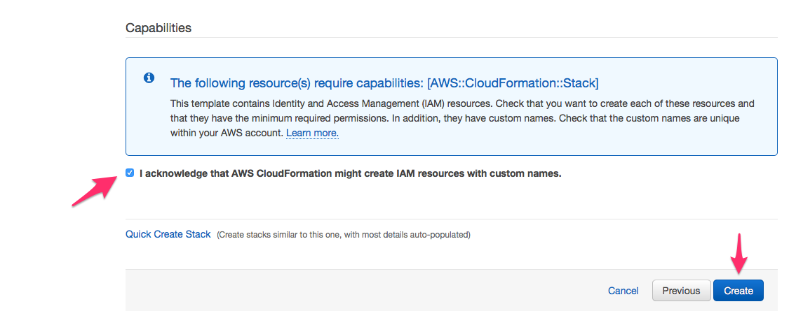

# TL;DR - For the impatient

## Core resources

### Amazon VPC

While you can use an existing "default" VPC to implement deployment of your genomics environment, we strongly recommend utilizing a VPC with private subnets for the processing sensitive data with AWS Batch. Doing so will restrict access to the instances from the internet, and help meet security and compliance requirements, such as [dbGaP](http://j.mp/aws-dbgap).

!!! tip
    You may also want to review the [HIPAA on AWS Enterprise Accelerator](https://aws.amazon.com/quickstart/architecture/accelerator-hipaa/) and the [AWS Biotech Blueprint](https://aws.amazon.com/quickstart/biotech-blueprint/core/) for additional security best practices such as:

    *  Basic AWS Identity and Access Management (IAM) configuration with custom (IAM) policies, with associated groups, roles, and instance profiles
    *  Standard, external-facing Amazon Virtual Private Cloud (Amazon VPC) Multi-AZ architecture with separate subnets for different application tiers and private (back-end) subnets for application and database
    *  Amazon Simple Storage Service (Amazon S3) buckets for encrypted web content, logging, and backup data
    *  Standard Amazon VPC security groups for Amazon Elastic Compute Cloud (Amazon EC2) instances and load balancers used in the sample application stack
    *  A secured bastion login host to facilitate command-line Secure Shell (SSH) access to Amazon EC2 instances for troubleshooting and systems administration activities
    *  Logging, monitoring, and alerts using AWS CloudTrail, Amazon CloudWatch, and AWS Config rules

| Name | Description | Source | Launch Stack |
| -- | -- | :--: | :--: |
{{ cfn_stack_row("VPC", "GenomicsVPC", "https://aws-quickstart.s3.amazonaws.com/quickstart-aws-vpc/templates/aws-vpc.template", "(Optional) Creates a new Virtual Private Cloud to use for your genomics workflow resources.") }}

The above template uses the AWS Quickstart reference for a [Modular and Scalable VPC Architecture](https://aws.amazon.com/quickstart/architecture/vpc/) and provides a networking foundation for AWS Cloud infrastructures, deploying an Amazon Virtual Private Cloud (Amazon VPC) according to AWS best practices and guidelines.

For architectural details, best practices, step-by-step instructions, and customization options, see the [deployment guide](https://fwd.aws/9VdxN).

### Full stack

The "Full Stack" CloudFormation template below will create all of the AWS resources required - S3 Bucket, EC2 Launch Templates, IAM Roles, Batch Compute Environments, Batch Job Queues - for your genomics workflow environment into an existing VPC.

| Name | Description | Source | Launch Stack |
| -- | -- | :--: | :--: |
{{ cfn_stack_row("Full Stack (Existing VPC)", "GenomicsEnv-Full", "aws-genomics-root-novpc.template.yaml", "Create EC2 Launch Templates, AWS Batch Job Queues and Compute Environments, a secure Amazon S3 bucket, and IAM policies and roles within an **existing** VPC. _NOTE: You must provide VPC ID, and subnet IDs_.") }}

Prior to the final create button, be sure to acknowledge "IAM CAPABILITIES".

The template will take about 15-20 minutes to finish creating resources.

Once completed, click on the `Outputs` tab and copy down the AWS Batch Job Queue ARN for the default and high-priority queues. You will need these when configuring your workflow orchestration system (e.g. AWS Step Functions, Cromwell, or Nextflow) to use AWS Batch as a backend for task distribution.

### Individual components

The CloudFormation templates above are [nested stacks](https://docs.aws.amazon.com/AWSCloudFormation/latest/UserGuide/using-cfn-nested-stacks.html), a hierarchy of templates that pass values from a parent template to dependent templates.

Below are the stand-alone CloudFormation templates for S3, IAM, and AWS Batch. These are handy in case you need to modify the individual components, or need to have another individual with elevated privileges to execute one of them (e.g. the IAM template). They are in order of dependency, and you will need to provide output values from one template to the dependent templates.

| Name | Description | Source | Launch Stack |
| -- | -- | :--: | :--: |
{{ cfn_stack_row("Amazon IAM Roles", "GenomicsWorkflow-IAM", "aws-genomics-iam.template.yaml", "Create the necessary IAM Roles. This is useful to hand to someone with the right permissions to create these on your behalf. _You will need to provide a S3 bucket name_.") }}
{{ cfn_stack_row("EC2 Launch Template", "GenomicsWorkflow-LT", "aws-genomics-launch-template.template.yaml", "Creates an EC2 Launch Template that provisions instances on first boot for processing genomics workflow tasks.") }}
{{ cfn_stack_row("Amazon S3 Bucket", "GenomicsWorkflow-S3", "aws-genomics-s3.template.yaml", "Creates a secure Amazon S3 bucket to read from and write results to.") }}
{{ cfn_stack_row("AWS Batch", "GenomicsWorkflow-Batch", "aws-genomics-batch.template.yaml", "Creates AWS Batch Job Queues and Compute Environments. You will need to provide the details on IAM roles and instance profiles, and the IDs for a VPC and subnets.") }}

## Worklow Orchestrators

| Name | Description | Source | Launch Stack |
| -- | -- | :--: | :--: |
{{ cfn_stack_row("Cromwell Server", "CromwellServer", "cromwell/cromwell-server.template.yaml", "Create an EC2 instance and an IAM instance profile to run Cromwell") }}

